# CRUD - Angular - Firebase - SweetAlert2

## Descripción:
Aplicación web que simula una agenda, en la que se pueden guardar, eliminar, editar y visualizar cada uno de los contactos registrados en firebase, mediante un formulario reactivo implementado en Angular 11.

## Caracteristicas:
1. Creación de contactos.
2. Lectura de contactos.
3. Actualización de contacto.
4. Eliminación de contactos.
5. Visualización independiente de cada contacto.
5. Validaciones Reactivas del formulario.

## Capturas

### Vista principal sin registros
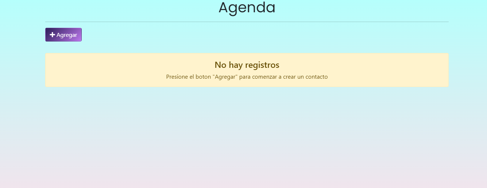

### Loading de espera
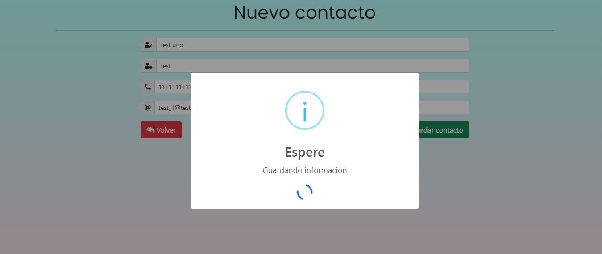

### Notificación de registro exitoso
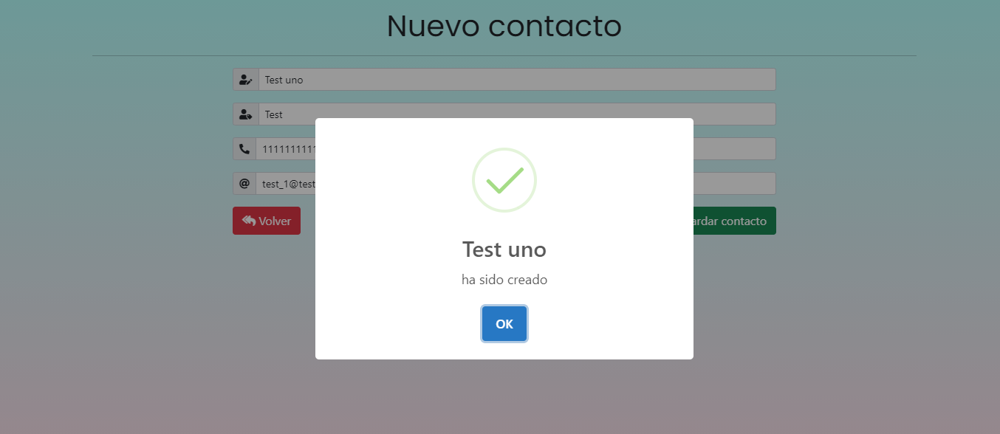

### Vista principal con registros
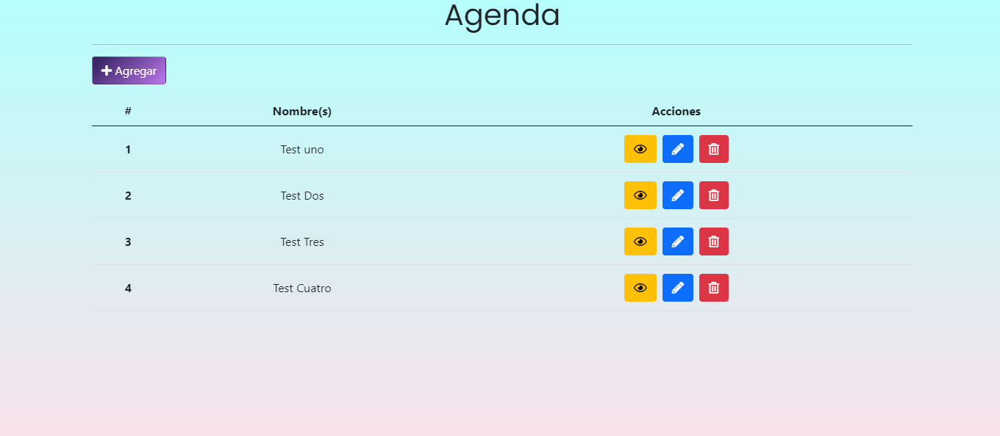

### Vista individual de cada contacto
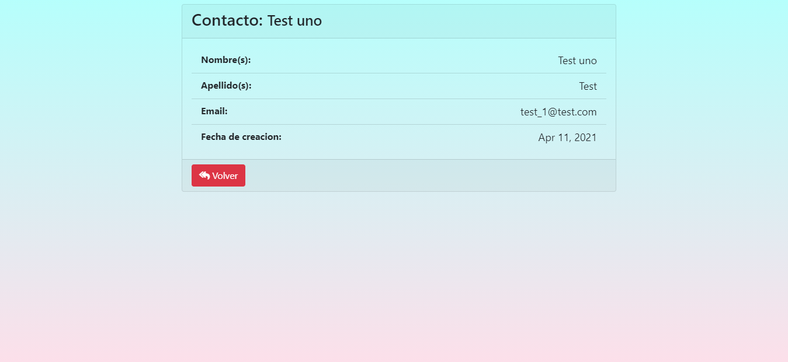

### Actualización de contacto
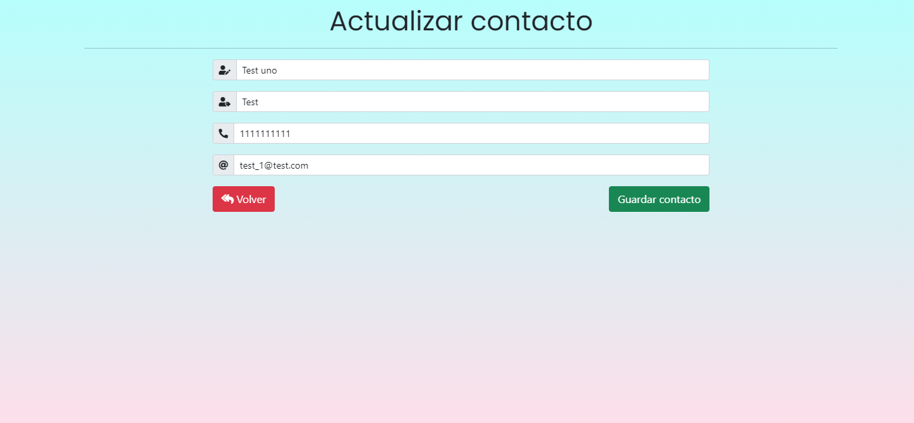

### Notificacion de contacto actualizado
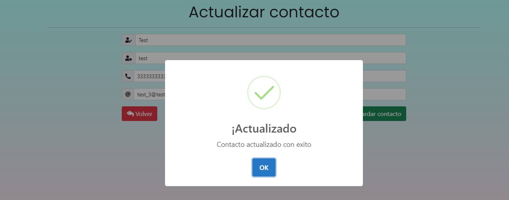

### Alerta de eliminación de contacto
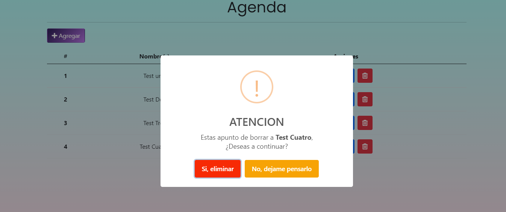

### Cancelarmiento del proceso de eliminación de contacto
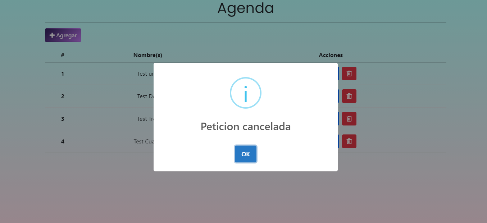

### Contacto Eliminado
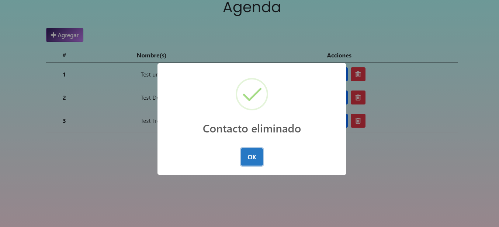

### Validación de formularios
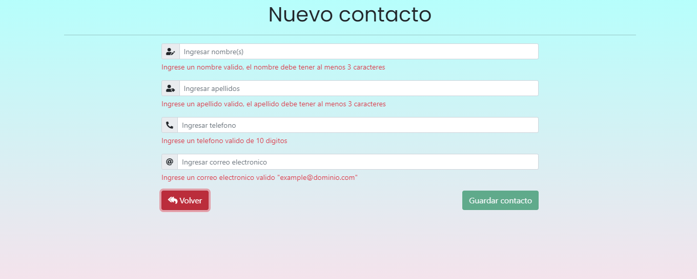

## Demo
